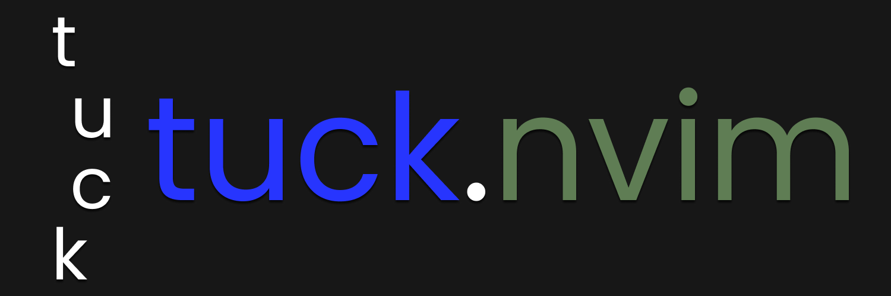

# Tuck.nvim

# Installation
Using your preferred package manager import the repo:
Commonly either `joshjkns/tuck.nvim` or `https://github.com/joshjkns/tuck.nvim`
Then just require tuck in your configuration file:
```lua
require("tuck")
```

# Usage

## :Tuck 
Allows you to 'tuck' text, basically **surround** text with a symbol from the following: **{ ( [ < " ' `**

Example:

```C
int main(void) return 0;
```

Highlighting `return 0;` in the example above and typing `:Tuck {` will create:

```C 
int main(void) {return 0;}
```

## Swapping (:Tuck -s)
:Tuck also supports swapping, for example:

```go
func main() { fmt.Println("Hello World") }
```

Highlighting `{ fmt.Println("Hello World") }` in the example avove and typing `:Tuck -s (` will create:

```go
func main() ( fmt.Println("Hello World") )
```

## :Untuck
Opposite of :Tuck, so just removes the surrounding characters.

```C 
int main(void) {return 0;}
```

Highlighting `{return 0;}` in the example above and typing `:Untuck` will create:


```C 
int main(void) return 0;
```


